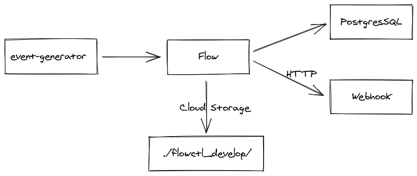

# Flow User Segmentation Demo

A common problem in the marketing domain is user segmentation. Many companies
maintain segments of their users to better understand behavior and address cohorts. A company may have many segmentation events coming in continuously, each of which represents an add or remove of a user to a segment.

These granular events must be transformed into current understandings of:

-   What users are in a given segment?
-   For a given user, what segments are they a member of?
-   Did an event actually change the status of a user & segment? Was it a repeated add or remove?

We'll use Flow to bring raw segmentation events into the system, transform them into new useful representations, and send them along to other systems.


## Setup

Machine Prerequisites:
- VSCode
- Docker

This demo is expected to be run with [VSCode Remote Containers](https://marketplace.visualstudio.com/items?itemName=ms-vscode-remote.remote-containers). This provides an polyglot environment which simulates disparate systems that Flow is connecting.
- Flow Runtime: This executes the **captures**, the **derivations**, and **materializations** defined in the `.flow.yaml` files.
- `flowctl`: The CLI tool for interacting with Flow.
- PostgreSQL: A vanilla database used for materializations.
- Node: Used for running a webhook server for materializations.

## Getting Started

To begin, open the root of the repo in VSCode. When prompted, "Reopen the Window" inside the container. This will take a moment as it pulls the Docker images. Once finished, you can open a bash shell in the VSCode Terminal which is automatically running inside the DevContainer.

- If you are not prompted to "Reopen the Window", make sure you have the Remote Containers extension installed. Once confirmed, you can run the "Remote Containers: Rebuild and Reopen Container" command via the command palette.
- You can check the progress of the build by opening the Build Log located in the Output tab of the bottom Workbench Panel.

## Flow Components

There are several files which describe how data flows through the system.

- `.flow.yaml`: These define the various catalog tasks that describe the system.
  - `1_captures.flow.yaml`: Captures characterize upstream data systems and **collections** into which segmentation events are captured.
  - `2_derive.flow.yaml`: Defines how collections will be transformed. Individual events will be combined to make user profiles, segment membership collections, and a timeline of segmentation toggles.
  - `3_materialize.flow.yaml`: Defines materialization endpoints that will receive the transformed data. The user profiles will be sent to a Postgresql table and the toggled events will be sent to a webhook endpoint.

- `.schema.yaml`: These JSON Schema files define the shape of the data being consumed and transformed by Flow. This helps the system guarantee data integrity through each step.
    - `schemas/event.schema.yaml`: Defines the format of the incoming json payloads representing a segmentation event.
    - `schemas/derived.schema.yaml`: Defines the format resulting from transforms applied to a collection.

- `.flow.ts`: These Typescript files define transformations of collection data. These will be executed for each event in a collection.
    - `2_derive.flow.ts`: Used by the Derivations defined in `2_derive.flow.yaml` to process individual events into new collections.

## Walkthrough

Let's see the system in action. We'll be launching these commands from several VSCode Terminals setup by the DevContainer.

### Terminal 1: `flowctl develop`

First we'll need to boot up the Flow runtime using `flowctl develop`. This mode of operating Flow allows for rapid iteration in a local development environment.

 We'll include our Flow catalog definition (`3_materialize.flow.yaml`). We'll also specify the port exposed by [flow-ingester](https://docs.estuary.dev/reference/pushing-data-into-flow#flow-ingester) for consuming incoming HTTP data.

```console
flowctl develop --source 3_materialize.flow.yaml --port 8080
```

Upon boot, Flow will validate our `.flow.yaml` configuration and begin connecting to external systems.

We'll be materializing to a PostgreSQL database, which does not yet exist. `flowctl develop` will create this database for us. You can examine the created PostgreSQL "segment_profiles" & "segment_memberships" tables which should roughly mirror the user profile schema.

### Terminal 2: Webhook Server

Next we'll setup our webhook server we'll be using as a materialization endpoint.

```console
node scripts/demo-webhook-api.js
```
This Node service will simply print the webhooks it receives to stdout so we can easily inspect the data being materialized to this endpoint.


## Observations:

1. Take a look at Terminal 2 and observe the data being sent to the materialization webhook server.

    This stream of events represents users being added or removed from a segment. Flow calls the webhook on de-duplicated status change ("member" <=> "non-member"). Note that initial "added to segment" events are filtered, so they are (relatively) rare.

    <details>
      <summary>Sample Output</summary>

      ```
      flow@dev-laptop:/workspace$ node scripts/demo-webhook-api.js
      [
      {"_meta":{"uuid":"5ad0a3e3-ee2f-11eb-8401-2be1e858ec26"},"event":"318178f5-098b-e1e5-09db-3c708e23d86e","previous":{"_meta":{"uuid":"0d078f8c-ebfb-11eb-8c01-6f58201be941"},"event":"133e46af-8279-52e1-ad3c-4251148918a3","segment":{"name":"seg-0","vendor":1},"timestamp":"2021-07-23T21:15:03Z","user":"usr-013770"},"remove":true,"segment":{"name":"seg-0","vendor":1},"timestamp":"2021-07-26T16:34:30Z","user":"usr-013770"}
      ]
      [
      {"_meta":{"uuid":"5c01c26a-ee2f-11eb-8401-2be1e858ec26"},"event":"add0c9f9-767b-32ec-1a52-6100a0591795","previous":{"_meta":{"uuid":"13067f18-ebfb-11eb-9401-6f58201be941"},"event":"92d921eb-5c7f-1a44-f26b-06d3dd040fc1","remove":true,"segment":{"name":"seg-0","vendor":1},"timestamp":"2021-07-23T21:15:13Z","user":"usr-017e0b"},"segment":{"name":"seg-0","vendor":1},"timestamp":"2021-07-26T16:34:32Z","user":"usr-017e0b"}
      ]
      [
      {"_meta":{"uuid":"5e2361c5-ee2f-11eb-8401-2be1e858ec26"},"event":"f0999d1d-bbdc-4fa7-3e85-470356778b47","previous":{"_meta":{"uuid":"1173c2c2-ebfb-11eb-a801-6f58201be941"},"event":"472ac81b-5d35-0580-3599-940c13722a0c","segment":{"name":"seg-0","vendor":1},"timestamp":"2021-07-23T21:15:10Z","user":"usr-00414c"},"remove":true,"segment":{"name":"seg-0","vendor":1},"timestamp":"2021-07-26T16:34:35Z","user":"usr-00414c"}
      ]
      ```
    </details>


2. We can use the SQLTools built into VSCode to quickly inspect the PostgreSQL database to see our materialized data.

    1. Open the SQLTools tab on the left side of the VSCode Window (under Explorer, Search, and Extensions).
    2. Expand the Container Database -> `flow` -> Schemas -> public -> Tables -> `segment_memberships`/`segment_profiles`.

        <details>
          <summary>Screenshot</summary>

          

        </details>

    3. Click the :mag: icon on `segment_memberships` to open a quick view of that table.

        <details>
          <summary>Screenshot</summary>

          

        </details>

3. Expanding our view on the materialized PostgresSQL data, we can run some simple queries that utilize the transformed data. We've included a few of these under the `queries` directory.

    1. Open `queries/pg_segment_membership.sql`.
    2. Click "Run on active connection" at the top of the Editor view to execute the query.

        <details>
          <summary>Screenshot</summary>

          

        </details>

    3. Wait a moment and then rerun it using the latest data processed by Flow.

        <details>
          <summary>Screenshot</summary>

          

        </details>

    4. Check out the other queries to see how this data changes over time.

        * `pg_user_active_segments.sql`: Range over users and show active segments (re-query to watch this update).
        * `pg_user_point_lookup.sql`: Point lookup of the active and inactive segments of a specific user.
        * `pg_segment_membership.sql`: Current user list of segments of a given vendor.

4. Inspect the raw data stored within the system.

    Flow does not lock your data away - it's always available in your own cloud storage as json files. `flowctl develop` stores these files locally in the `flowctl_develop` directory, rather than uploading them. This makes it easy to inspect output as you work.

    Let's take a look at these "fragment files" which hold the data contained in Flow collections.

    ```console
    $ find flowctl_develop/fragments/examples/segment/events -type f
    ```

    <details>
      <summary>Sample Output</summary>

      ```console
      flow@dev-laptop:/workspace$ find flowctl_develop/fragments/examples/segment/events/ -type f
      flowctl_develop/fragments/examples/segment/events/vendor=3/pivot=00/utc_date=2021-07-22/utc_hour=21/0000000000000000-00000000000000da-03f267c8d64e19341551e5a96c8b75ffd1a30e85.gz
      flowctl_develop/fragments/examples/segment/events/vendor=3/pivot=00/utc_date=2021-07-22/utc_hour=21/00000000000000da-000000000009b20f-eac8d53f6f9f71d5d8c200c5c1e3b61097a9e812.gz
      flowctl_develop/fragments/examples/segment/events/vendor=3/pivot=00/utc_date=2021-07-22/utc_hour=21/000000000009b20f-0000000000292fcf-01c22fb09cf90cb644d509bdf8af248743cf9634.gz
      flowctl_develop/fragments/examples/segment/events/vendor=3/pivot=00/utc_date=2021-07-23/utc_hour=21/0000000000292fcf-00000000002cf9b6-97ab85b98f334035fd166dedcf65e09ac963f1da.gz
      flowctl_develop/fragments/examples/segment/events/vendor=3/pivot=00/utc_date=2021-07-23/utc_hour=21/00000000002cf9b6-000000000032eab0-755e5add629f2f59f30e54c80eedfd18f02c8447.gz
      ```
    </details>

    These compressed json files can be easily inspected.

      ```console
      $ zcat flowctl_develop/fragments/PATH_TO_A_FRAGMENT.gz | jq '.'
      ```

      <details>
        <summary>Sample Output</summary>

        ```console
        flow@dev-laptop:/workspace$ zcat flowctl_develop/fragments/examples/segment/events/vendor=3/pivot=00/utc_date=2021-07-22/utc_hour=21/0000000000000000-00000000000000da-03f267c8d64e19341551e5a96c8b75ffd1a30e85.gz | jq '.'
        {
          "_meta": {
            "uuid": "1d99902e-eb31-11eb-8401-35b56d2a9099"
          },
          "event": "032e507a-cc8c-2aa4-7e8b-c7b3924ed63d",
          "remove": true,
          "segment": {
            "name": "seg-52",
            "vendor": 3
          },
          "timestamp": "2021-07-22T17:09:34-04:00",
          "user": "usr-00bda6"
        }
        ```
      </details>
## Experiments

1. Add Back-Pressure:
    - Try increasing `delay` parameter in `demo-webhook-api.js`.
    - This models slow APIs / network delay / back-pressure.
    - When increased, Flow does more roll-up per call.
    - When decreased, Flow makes more frequent, smaller calls.

2. Increased Load:
    - Try increasing `maxEventsPerSecond` parameter in `1_capture.flow.yaml`.
    - Watch how "toggles" calls are much bigger.
    - Try increasing `segmentCardinality` parameter in `1_capture.flow.yaml`.
    - Watch how "toggles" calls are less frequent.

## Also See

#### Tests

Flow enables you to write concise tests describing the data flowing through the system.

Run the tests for the segmentation workflow.

```console
$ flowctl test --source 4_tests.flow.yaml`
```

Change a username value in a `verify` block to see how Flow reports test failures.

#### Cleanup:

If you'd like to reset your environment to its pristine state:

  1. `git clean -f -d` to remove `flowctl_develop` directory.
  1. Run `queries/pg_reset_tables.sql` to restore PostgreSQL.
